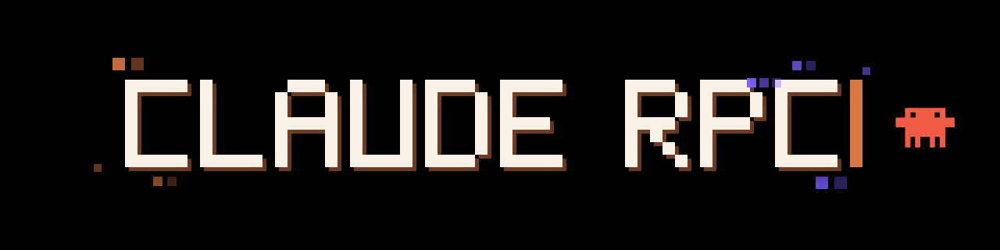

<p align="center"></p>

# Claude RPC

Claude RPC shows your Claude Code and Claude Desktop activity as a Discord Rich Presence on Windows. A tray app detects the running Claude client, the model and effort, the provider or plan and the usage limits, then publishes them to the Discord desktop app.

## Requirements

- Windows 10 or 11 with the Microsoft Edge WebView2 runtime.
- The Discord desktop app, running and signed in.
- Claude Code (CLI) or Claude Desktop.

To build from source:

- Rust 1.88.0 (the version used by CI and releases).
- Node.js 22 and npm.
- Visual Studio Build Tools with the C++ workload.

## Install

Download one of these files from the latest GitHub release:

- `Claude.RPC_3.9.0_x64-setup.exe`: installer.
- `claude-rpc.exe`: portable executable.

Versions before v3.7.0 cannot verify the current update signature. Install v3.7.0 or later manually once; later updates install from the app.

Build from source:

```powershell
npm ci
npm test
npm run build
```

`npm run build` writes `src-tauri\target\release\claude-rpc.exe`, the installer under `src-tauri\target\release\bundle\nsis\`, and a copy at `bin\claude-rpc.exe`. The signing step at the end fails without `TAURI_SIGNING_PRIVATE_KEY`; the executable and installer are already written at that point.

## Usage

Start Claude RPC. It runs in the notification area.

- Left-click the icon to open the settings.
- Right-click the icon to open the menu: live status card with usage bars, pause (30 minutes, 1 hour, until midnight, or always), start with Windows, activity type, updates.
- Hover the icon to see the model and the usage limits.

Settings save as soon as they change. The Discord preview at the top of the settings shows the card as published, or why nothing is published.

## Configuration

Settings are stored in `%USERPROFILE%\.claude-rpc\config.json`. The settings window edits every key below.

| Key | Type | Default | Effect |
|---|---|---|---|
| `rpcMode` | string | `playing` | Activity type: `playing`, `watching`, `listening` or `competing`. |
| `dnd` | bool | `false` | Publish nothing while detection keeps running. |
| `pauseUntilMs` | number | `0` | Publish nothing until this Unix time in milliseconds. |
| `showProvider` | bool | `true` | Show the provider (Subscription, Anthropic API, AWS Bedrock, Google Vertex, Microsoft Azure). |
| `showPlan` | bool | `true` | Replace "Subscription" with the Claude plan. Needs `showProvider`. |
| `showEffort` | bool | `true` | Show the thinking effort. |
| `showSessions` | bool | `false` | Show the number of open Claude Code sessions when there are two or more. |
| `modelIcon` | bool | `false` | Use the model family icon as the small Discord image. |
| `showLimits` | bool | `true` | Show usage limits on Discord. |
| `showLimit5h`, `showLimitAll`, `showLimitFable` | bool | `true` | Choose the 5-hour, weekly and Fable weekly limits shown on Discord. |
| `detailsTemplate`, `stateTemplate` | string | `""` | Custom Discord lines. Empty uses the default text. |
| `privateProjects` | string list | `[]` | Folder names or paths whose sessions are never published. |
| `hideInChat` | bool | `false` | Publish nothing while the Claude Desktop Chat tab is open. |
| `alert80`, `alert95`, `alertReset` | bool | `true` | Windows notifications for the 5-hour session. |
| `language` | string | `auto` | Interface language: `auto`, `en` or `fr`. |
| `buttons` | list | Claude, GitHub Repo | Up to two `{ "label", "url" }` buttons, sent in `watching` mode only. |

Template variables: `{model}`, `{effort}`, `{plan}`, `{provider}`, `{limits}`, `{limit5h}`, `{limitWeekly}`, `{limitFable}`, `{sessions}`, `{project}`, `{client}`, `{mode}`.

Environment variables:

| Variable | Default | Effect |
|---|---|---|
| `CLAUDE_RPC_DIR` | `%USERPROFILE%\.claude-rpc` | Folder for settings, status, usage cache and usage history. |
| `CLAUDE_DIR_PATH` | `%USERPROFILE%\.claude` | Claude Code data folder. |
| `DISCORD_CLIENT_ID` | built-in application | Discord application used for the presence. |
| `SCAN_INTERVAL_MS` | `250` | Process scan interval, minimum 250. |
| `CLAUDE_MODEL`, `ANTHROPIC_MODEL` | none | Model fallback when no session names one. |

## Detection

| Target | Source |
|---|---|
| Claude Desktop | `claude.exe` process path. |
| Desktop mode and model | UI Automation labels of the Claude window, read every 2 seconds, and `%APPDATA%\Claude\claude_desktop_config.json`. |
| Claude Code model | Latest session log in `~\.claude\projects`, `/model` output, then settings and environment fallbacks. |
| Plan | `~\.claude\.credentials.json`, then `~\.claude.json`. |
| Usage limits | Claude usage API with the Claude Code sign-in, and the Claude Desktop usage button and popover. |

## Limitations

- Windows only. macOS support was removed in v3.9.0.
- Desktop detection reads window labels. A Claude Desktop interface change can break model or mode detection until the app is updated.
- Discord shows buttons only in `watching` mode, and only to viewers with Discord Nitro.
- The model icons load from this repository's `main` branch on GitHub.
- Usage limits need a Claude subscription signed in to Claude Code, or Claude Desktop open.

## License

MIT. See `LICENSE`.
